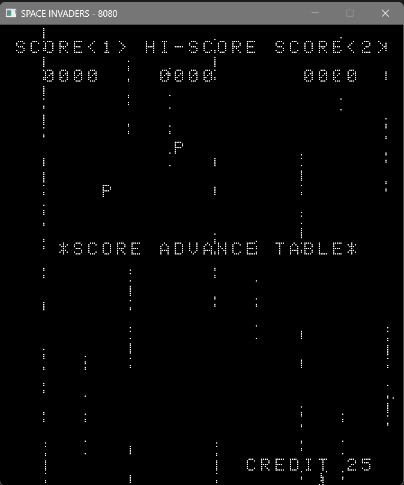

# Space Invaders on the 8080

Emulator is a work in progress!! <br>
A space invaders emulator, like the one from arcade machines back in 1970s. The Space Invaders ran on an Intel 8080. This is supposed to emulate that entire machine, rather than the 8080 alone. The buttons and coin inserts are mapped to the keyboard. <br>

GUI using [allegro](https://liballeg.org/)<br>

# Inputs - 
I have mapped the inputs to be -

```
COIN INSERT - Left Key Shift

Player 1 -
    LEFT - A
    RIGHT - D
    FIRE - Space
    START - Num 1
    
Player 2 -
    LEFT - Arrow Left
    RIGHT - Arrow  Right
    FIRE - Arrow Up
    START - Num 2
```


Its still extremely buggy, but the CPU passes the diagnostic tests from 
<br>
[CPUDIAG.asm](http://www.emulator101.com/files/cpudiag.asm). <br>
[8080PRE.COM](https://altairclone.com/downloads/cpu_tests/). <br>
[CPUTEST.COM](https://altairclone.com/downloads/cpu_tests/). <br>
And most of [8080EXM.COM](https://altairclone.com/downloads/cpu_tests/), the final boss. <br>


It can display the home screen a little bit. <br>

After reading that cpudiag is usually not that thorough, im running it through other tests to check my implementation. I hope to get the game up and running on it soon.

This is how much output i attain on Space Invaders.


